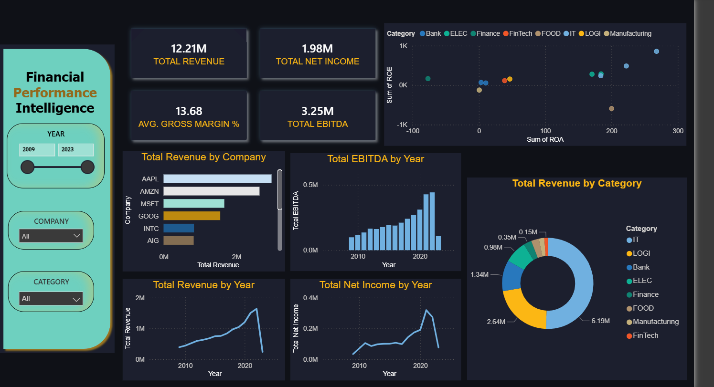
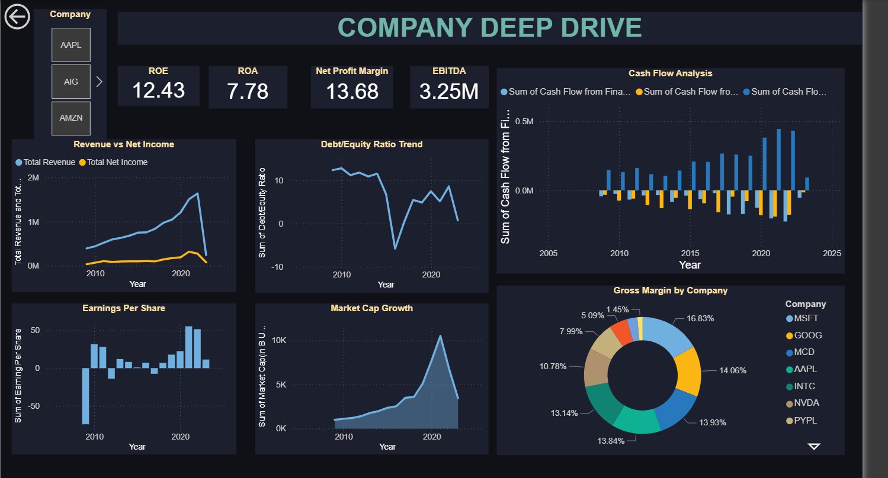
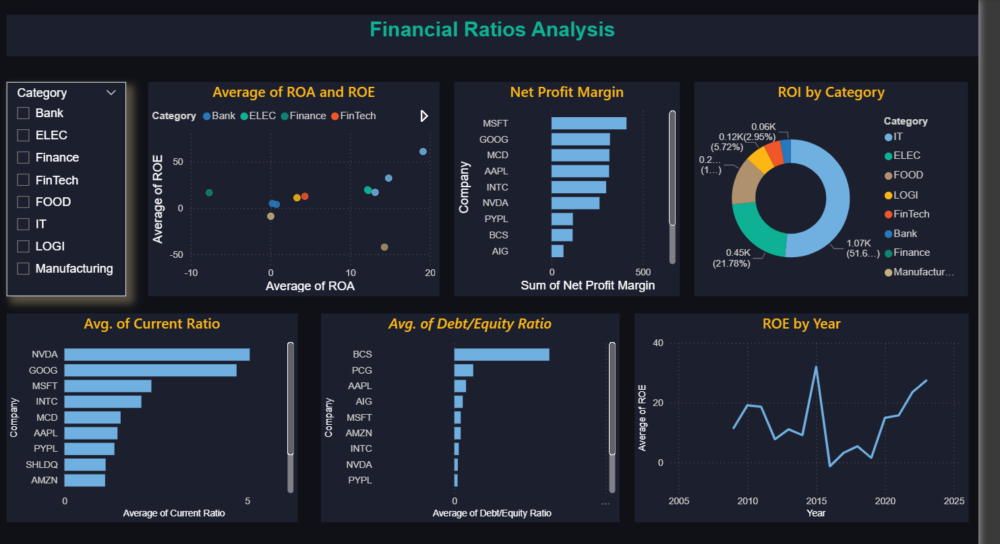

# Financial Performance Intelligence

A multi-page interactive Power BI dashboard analysing the financial performance of major global companies from 2009 to 2023. Built as a portfolio project targeting data analyst roles in financial services, retail, and business intelligence.

---

## Dashboard Overview

This project transforms raw financial statement data into a three-page interactive intelligence report, covering executive-level KPIs, company-level deep dives, and financial ratio analysis. Every visual is connected through slicers and drill-through navigation, making it fully interactive and stakeholder-ready.

**Pages:**

- **Page 1 — Financial Performance Overview** — Executive summary with revenue trends, EBITDA growth, sector breakdown, and ROE vs ROA scatter analysis across all companies and years.
- **Page 2 — Company Deep Dive** — Drill-through page showing individual company performance including revenue vs net income, cash flow analysis, market cap growth, earnings per share, and debt/equity trend.
- **Page 3 — Financial Ratios Analysis** — Pure ratio comparison page covering ROE, ROA, net profit margin ranking, current ratio, debt/equity ratio, and ROI by sector.

---

## Screenshots

### Page 1 — Financial Performance Overview


### Page 2 — Company Deep Dive


### Page 3 — Financial Ratios Analysis


---

## Key Features

- **Interactive slicers** — filter by Year, Company, and Category across all pages simultaneously
- **Drill-through navigation** — right-click any company on Page 1 to drill through to their full profile on Page 2
- **DAX measures** — custom measures for Total Revenue, Total Net Income, Avg Gross Margin %, Total EBITDA, and YoY calculations
- **Data modelling** — star schema with a custom DateTable linked to the fact table for time intelligence
- **Cross-page consistency** — unified dark theme, consistent colour palette, and matching layout across all three pages

---

## Tech Stack

| Tool | Usage |
|------|-------|
| Power BI Desktop | Dashboard development, visualisation, publishing |
| DAX | Custom measures, time intelligence, KPI calculations |
| Power Query (M) | Data transformation, custom column creation, type casting |
| Excel / CSV | Source data preparation and inspection |

---

## DAX Measures Used

```dax
Total Revenue = SUM('Financial Statements'[Revenue])

Total Net Income = SUM('Financial Statements'[Net Income])

Total EBITDA = SUM('Financial Statements'[EBITDA])

Avg Gross Margin % = AVERAGE('Financial Statements'[Net Profit Margin])
```

---

## Dataset

**Source:** [Financial Statements of Major Companies 2009–2023](https://www.kaggle.com/datasets/rish59/financial-statements-of-major-companies2009-2023) — Kaggle

**Coverage:** 15 major global companies across IT, Finance, Banking, FMCG, Logistics, and Manufacturing sectors

**Columns used:** Revenue, Gross Profit, Net Income, EBITDA, EPS, Market Cap, Cash Flows (Operating / Investing / Financing), ROE, ROA, ROI, Net Profit Margin, Current Ratio, Debt/Equity Ratio, Shareholder Equity, Number of Employees, Inflation Rate

---

## Project Structure

```
Financial-Performance-Intelligence/
│
├── Financial Performance Intelligence.pbix
├── README.md
│
├── screenshots/
│   ├── page1.png
│   ├── page2.png
│   └── page3.png
│
└── dataset/
    └── Financial Statements.csv
```

---

## Business Questions Answered

- Which companies generated the highest revenue and net income between 2009 and 2023?
- How did the 2020 COVID-19 period impact revenue and net income across sectors?
- Which sectors deliver the strongest return on equity and return on assets?
- How has market capitalisation grown relative to earnings per share over time?
- Which companies carry the highest debt relative to equity, and what does that signal?
- How do operating, investing, and financing cash flows compare across companies?

---

## How to Use

1. Download the `.pbix` file
2. Open in Power BI Desktop (free download from Microsoft)
3. Use the Year slicer to filter by time period
4. Use the Category and Company slicers to isolate sectors or individual companies
5. On Page 1, right-click any company in the bar chart → Drill through → Company Deep Dive to see their full financial profile

---

## Author

**Suriya Prasath Parameswaran**
Data Analyst | Power BI | Python | SQL | Machine Learning

[GitHub](https://github.com/) · [LinkedIn](https://linkedin.com/)

---

*Built as part of a data analyst portfolio. Dataset sourced from Kaggle under public licence.*
